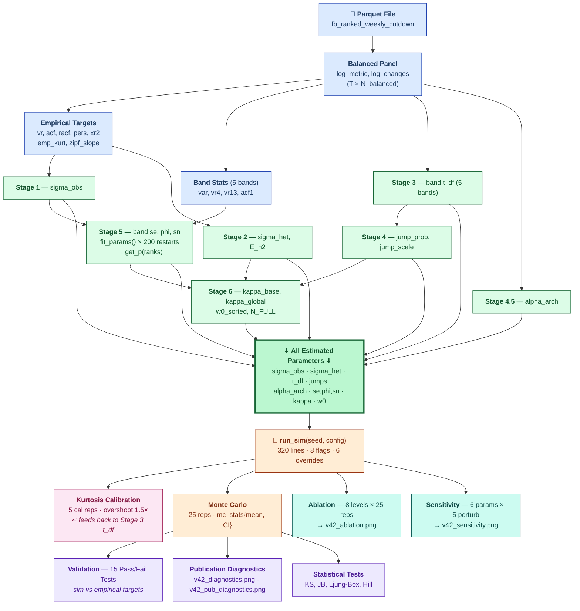
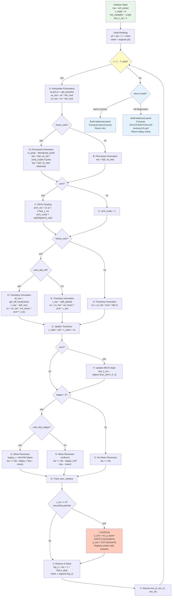

# Model v4.2 Code Map

**File**: `model_v42.py` (2,043 lines)
**Model**: Permanent-Transitory Rank Diffusion with heavy tails, ARCH(1), rank-dependent mean reversion

---

## 1. Annotated Structural Outline

### Phase 0: Setup & Estimation (lines 1-424)

```
IMPORTS & PATHS                                          lines   1-48
  numpy, pandas, scipy, pathlib, matplotlib
  BASE_DIR, DATA_DIR, t_start
```

#### Data Loading & Empirical Targets (lines 50-141)

| Lines | Block | Key Outputs |
|-------|-------|-------------|
| 57-71 | Load parquet, balanced panel, weekly stats | `df`, `n_weeks`, `all_weeks_eps`, `N_balanced`, `mean_N`, `mean_exits` |
| 73-78 | Pivot to matrices, log-transform | `metric_pivot`, `rank_pivot`, `log_metric`, `log_changes` |
| 80-84 | Per-endpoint variance, variance ratios | `var_1`, `vr_emp{2,3,4,6,8,13,17,26,39,52}` |
| 86-95 | ACF and rank ACF on sample of 2000 eps | `acf_emp{1,2,3,4,8}`, `racf_emp{1,4,13,26,52}` |
| 97-105 | Top-100 persistence, cross-sectional R^2 | `pers_emp{1,4,13,26,52}`, `xr2_emp{1,4,13,26,52}` |
| 107-109 | Zipf slope (log-log rank-size, top 5000) | `zipf_slope` |
| 111-119 | Global kurtosis, variance stats, xsec var | `all_ch_emp`, `emp_kurt`, `emp_mean_var`, `emp_median_var`, `xsec_var_emp`, `xsec_var_full` |
| 124-136 | Band-level stats (5 bands) | `avg_rank`, `band_stats{n, var, vr4, vr13, acf1}` |

#### Stage 1: Observation Noise (lines 143-177)

```
[MATH]  phi_agg = acf_emp[3] / acf_emp[2]
        gamma1 = acf_emp[1] * median_var
        gamma2 = acf_emp[2] * median_var
        sigma2_obs = clip(-gamma1 + gamma2/phi_agg, 0.01^2, 0.50^2)
        sigma_obs = sqrt(sigma2_obs)

[INPUT]  acf_emp, emp_median_var
[OUTPUT] sigma_obs, sobs2
```

#### Stage 2: Heterogeneity (lines 179-186)

```
[MATH]  sigma_het = sqrt(log(mean_var / median_var) / 2)
        E_h2 = exp(2 * sigma_het^2)

[INPUT]  emp_mean_var, emp_median_var
[OUTPUT] sigma_het, E_h2
```

#### Stage 3: Band-Level t-Distribution Degrees of Freedom (lines 188-250)

```
[MATH]  Within-endpoint standardized residuals:
          z_ep = (ch - mean(ch)) / std(ch)
        Global MLE: scipy.stats.t.fit(z_within) -> df_fit
        Per-band MLE with noise correction:
          signal_frac = max(0.05, 1 - 2*sobs2 / total_var)
          if signal_frac < 0.30: df_corrected = min(df/signal_frac, 200)

[INPUT]  log_changes, sample_eps, band_stats, sobs2
[OUTPUT] z_within, t_df_global, loc_fit, scale_fit, band_tdf{}, tdf_arr
```

#### Stage 4: Jump Parameters (lines 252-263)

```
[MATH]  expected_tail = 2 * P(t > 4; df=t_df)
        actual_tail = mean(|z - loc| > 4*scale)
        jump_prob = max(0.005, actual - expected)
        jump_scale = std(z_extreme) / std(z_normal)

[INPUT]  z_within, t_df, loc_fit, scale_fit
[OUTPUT] jump_prob, jump_scale
```

#### Stage 4.5: ARCH(1) Coefficient (lines 265-289)

```
[MATH]  For each endpoint:
          z_sq = ((ch - mu) / std)^2
          acf_sq1 = sum(z_sq_dm[:-1] * z_sq_dm[1:]) / ((n-1) * var(z_sq))
        alpha_arch = clip(median(acf_sq1 values), 0.01, 0.50)

[INPUT]  log_changes, sample_eps
[OUTPUT] alpha_arch
```

#### Stage 5: Structural Estimation (lines 291-353)

```
Functions defined:
  model_vr(k, se2, phi, sn2, sobs2)    [lines 295-300]  -- theoretical VR(k)
  model_acf1_fn(se2, phi, sn2, sobs2)  [lines 302-306]  -- theoretical ACF(1)
  fit_params(emp_var, vr4, acf1, ...)   [lines 309-330]  -- 200-restart Nelder-Mead

[MATH]  Parameterization: se2=exp(p0), phi=0.95/(1+exp(-p1)), sn2=exp(p2)
        Loss = 10*(log(mvar)-log(emp_var))^2
             + 5*(model_vr(4) - emp_vr4)^2
             + 3*(model_acf1 - emp_acf1)^2
             + 2*(model_vr(13) - emp_vr13)^2

Band estimation loop:                    [lines 332-342]
Interpolation arrays:                    [lines 344-347]
  get_p(ranks)                           [lines 349-353]  -- log-linear interp

[INPUT]  band_stats, sobs2
[OUTPUT] band_params{se,phi,sn,se2,sn2,pf}, bc_arr, ses/phs/sns_arr, get_p()
```

#### Stage 6: Mean-Reversion Calibration (lines 355-424)

```
[MATH]  mean_eta2 = E_h2 * mean_se2 * (1 - jump_prob + jump_prob * jump_scale^2)
        kappa_base_raw = max(mean_eta2 / (2 * weighted_dev2), 0.001)
        kappa_base = kappa_base_raw * 1.20   [stabilization factor]
        kappa(r) = kappa_base * (r/N)^0.5

Initial cross-section: w0_sorted (with log-linear tail extension)

[INPUT]  mean_N, band_params, band_stats, jump_prob, jump_scale, E_h2, df, dates
[OUTPUT] N_FULL, kappa_base, kappa_base_raw, kappa_global, w0_sorted
         inc_alpha=0.3, inc_p_base=0.0052, trans_p_exit=0.07
```

---

### Phase 1: Simulation & Validation (lines 426-1693)

#### Simulation Configuration (lines 426-437)

```
T_SIM = n_weeks,  T_BURNIN = 50,  N_REP = 25
```

#### Unified Simulation Kernel: `run_sim()` (lines 440-759)

```
SIGNATURE: run_sim(seed, *, config=None, return_extra=False,
                   return_band_kurtosis=False)

3 RETURN MODES:
  band_kurtosis=True  -> dict{band: kurtosis}     [quick calibration]
  return_extra=True   -> (diag_dict, arrays_dict)  [seed=42 rep]
  default             -> (diag_dict, None)          [normal MC rep]

8 FEATURE FLAGS (all default True):
  burn_in, kappa, rank_dep_kappa, kappa_stab,
  heavy_tails, arch, rank_dep_tdf, calibrated_tdf

6 PARAMETER OVERRIDES:
  sigma_obs, sigma_het, kappa_base, alpha_kappa, alpha_arch, t_df_global

INTERNAL FUNCTIONS:
  get_tdf_local(ranks)                [lines 493-499]  -- rank-interpolated t_df

STATE VARIABLES (N_FULL-dimensional):
  tau            permanent component (log scale)
  c_state        transitory AR(1) component
  het_multiplier endpoint-specific volatility scale
  ep_type        0=incumbent, 1=transient entrant
  endpoint_id    unique integer ID per endpoint
  last_z_sq      ARCH(1) state (squared standardized innovation)
  ranks          current rank vector (1..N_FULL)
```

See Section 3 (Control Flow Diagram) for the per-step simulation logic.

#### Kurtosis Calibration (lines 762-851)

```
5 calibration reps -> median sim kurtosis per band
Compare to empirical band kurtosis
If |sim - emp|/emp > 10% and not protected band:
  Adjust t_df using analytical t-kurtosis formula with 1.5x overshoot

Protected bands: (1,100), (101,500)
Overshoot factor: 1.5

[INPUT]  run_sim(band_kurtosis mode), band_tdf, tdf_arr
[OUTPUT] band_tdf (calibrated), tdf_arr (updated), tdf_arr_precal (saved)
```

#### Main Monte Carlo (lines 853-880)

```
25 reps: seeds = [42, 100, 101, ..., 123]
Seed 42 -> return_extra=True (for publication diagnostics)
Aggregate: mc_stats{mean, std, lo, hi, median} per diagnostic key

[INPUT]  run_sim() x 25
[OUTPUT] all_diags[], rep_extra, mc_stats{}
```

#### Validation (lines 882-968)

```
15 diagnostics: VR(2,4,8,13), ACF(1,2), RACF(1,4,13),
                Pers(1,4,13), R2(1,4,13)
Pass/fail thresholds:
  VR:   |sim-emp|/emp < 20%
  ACF:  |sim-emp| < 0.08
  RACF: |sim-emp| < 0.08
  Pers: |sim-emp| < 10
  R2:   |sim-emp| < 0.08

[OUTPUT] tests{}, n_pass (target: 15/15)
```

#### MC Uncertainty Analysis (lines 970-1013)

```
For each diagnostic: MC SE, distance-to-threshold, fragility label
Labels: "solid" (d/SE > 3), "marginal" (> 1.5), "FRAGILE"
```

#### Publication Diagnostics & Figures (lines 1015-1693)

```
Statistical tests:             [lines 1036-1068]  KS, Jarque-Bera
Ljung-Box serial correlation:  [lines 1070-1091]
Hill tail index:               [lines 1093-1110]  hill_estimator() defined
Transition matrices:           [lines 1117-1163]  compute_transition_matrix() defined
Half-life by stratum:          [lines 1165-1214]
Kurtosis by band:              [lines 1216-1238]
Volatility clustering:         [lines 1240-1257]
Figure 1 (15 panels):          [lines 1259-1414]  -> v42_diagnostics.png
Figure 2 (15 panels):          [lines 1416-1684]  -> v42_pub_diagnostics.png
```

---

### Phase 2: Ablation Study (lines 1694-1887)

```
8 cumulative levels:
  1. Base (PT+Gauss)     -- no burnin, no kappa, Gaussian
  2. +Burn-in            -- add 50-week burn-in
  3. +kappa (global)     -- uniform mean reversion
  4. +kappa(r)           -- rank-dependent mean reversion
  5. +Heavy tails        -- t-distributed + jumps
  6. +ARCH(1)            -- volatility clustering
  7. +Rank-dep t_df      -- calibrated per-band t_df
  8. +kappa-stab (v3.9)  -- full model with stabilized kappa

Each level: 25 MC reps, same seeds as main run
Scoring: 15 diagnostics, pass/fail -> score/15
abl_passes() defined [lines 1762-1768]

[OUTPUT] all_abl_results[], v42_ablation.png
```

---

### Phase 3: Parameter Sensitivity (lines 1889-2021)

```
6 parameters: sigma_obs, sigma_het, kappa_base, alpha_kappa, alpha_arch, t_df_global
5 perturbations: -20%, -10%, 0%, +10%, +20%
Each combination: 25 MC reps (seeds: 42, 300..323)

[OUTPUT] all_sens_results{}, v42_sensitivity.png
```

---

### Final Summary (lines 2024-2043)

```
Print: pass count, ablation score trajectory, sensitivity robustness
```

---

## 2. Data Flow Diagram

Rendered version: `v42_dataflow.png` (compiled from `v42_dataflow.mmd`).

**Design note**: This diagram avoids Mermaid subgraphs and backward edges
(which cause dagre to produce tangled layouts). Instead it uses a
**collector node** ("All Estimated Parameters") to funnel the 7 estimation
stages into a single edge feeding `run_sim`, and replaces the calibration
feedback loop with an inline annotation.



---

## 3. Simulation Kernel Control Flow

Rendered version: `v42_kernel_flow.png` (compiled from `v42_kernel_flow.mmd`).

The core time loop inside `run_sim()` (lines 534-638):



---

## 4. Call Graph

```
                          ┌─────────────────────────────────────────────┐
                          │            TOP-LEVEL SCRIPT                  │
                          │                                             │
                          │  Data Loading ──► Stages 1-6 ──► Config    │
                          └──────────────┬──────────────────────────────┘
                                         │
            ┌────────────────────────────┼────────────────────────────┐
            │                            │                            │
            ▼                            ▼                            ▼
   ┌─────────────────┐       ┌─────────────────────┐      ┌──────────────────┐
   │  fit_params()   │       │     run_sim()        │      │  abl_passes()    │
   │  lines 309-330  │       │   lines 440-759      │      │  lines 1762-1768 │
   │                 │       │                      │      │                  │
   │  200 restarts   │       │  CALLED BY:          │      │  CALLED BY:      │
   │  Nelder-Mead    │       │    Kurtosis cal L793 │      │    Ablation L1793│
   │                 │       │    Main MC     L863  │      │    Sensitiv L1932│
   │ CALLED BY:      │       │    Ablation    L1779 │      └──────────────────┘
   │   Stage 5 L335  │       │    Sensitiv    L1923 │
   └────────┬────────┘       └──────────┬───────────┘
            │                           │
     ┌──────┴──────┐             ┌──────┴──────────────────┐
     │             │             │                         │
     ▼             ▼             ▼                         ▼
┌──────────┐ ┌───────────┐ ┌──────────┐        ┌────────────────────┐
│model_vr()│ │model_acf1 │ │ get_p()  │        │ get_tdf_local()    │
│ L295-300 │ │  _fn()    │ │ L349-353 │        │ L493-499 (nested)  │
│          │ │ L302-306  │ │          │        │                    │
│ VR(k)    │ │ ACF(1)    │ │ Interp   │        │ Interp t_df by     │
│ theory   │ │ theory    │ │ se,phi,sn│        │ rank (calibrated   │
│          │ │           │ │ by rank  │        │ or pre-cal)        │
└──────────┘ └───────────┘ └──────────┘        └────────────────────┘

                   ┌──────────────────────────────────────────┐
                   │   PUBLICATION DIAGNOSTIC HELPERS          │
                   │                                          │
                   │  hill_estimator()      L1095-1102        │
                   │    Called at L1107, L1516                 │
                   │                                          │
                   │  compute_transition_matrix()  L1117-1129 │
                   │    Called at L1133,1136,1141,1153,        │
                   │              1667,1672                    │
                   └──────────────────────────────────────────┘
```

---

## 5. Function Complexity Table

| Function | Lines | Span | Params | Callees | Branches | Risk |
|----------|-------|------|--------|---------|----------|------|
| `run_sim` | 440-759 | **320** | 4 (+8 flags, +6 overrides) | 6 | 18 | **HIGH** |
| `fit_params` | 309-330 | 22 | 5 | 3 | 2 | Medium |
| `compute_transition_matrix` | 1117-1129 | 13 | 3 | 0 | 2 | Low |
| `hill_estimator` | 1095-1102 | 8 | 2 | 0 | 0 | Low |
| `model_vr` | 295-300 | 6 | 5 | 0 | 1 | Low |
| `model_acf1_fn` | 302-306 | 5 | 4 | 0 | 1 | Low |
| `get_p` | 349-353 | 5 | 1 | 0 | 0 | Low |
| `get_tdf_local` | 493-499 | 7 | 1 | 0 | 1 | Low |
| `get_tdf_precal` | 843-846 | 4 | 1 | 0 | 0 | Low |
| `abl_passes` | 1762-1768 | 7 | 3 | 0 | 2 | Low |

**Review priority**: `run_sim` is by far the highest-risk function (320 lines,
18 conditional branches, 6 external callees, closure over ~20 module-level
variables). All other functions are small, pure, and low-risk.

---

## 6. Top-Level Code Block Map (non-function code)

```
Line     Block                              Size    Variables Created
──────── ─────────────────────────────────── ─────── ──────────────────────────────
   1-48  Imports, paths, timer                48    BASE_DIR, DATA_DIR, t_start
  50-141 Data loading & empirical targets     92    df, log_metric, log_changes,
                                                    vr_emp, acf_emp, racf_emp,
                                                    pers_emp, xr2_emp, band_stats...
 143-177 Stage 1: sigma_obs                   35    sigma_obs, sobs2
 179-186 Stage 2: sigma_het                    8    sigma_het, E_h2
 188-250 Stage 3: band t_df                   63    band_tdf, tdf_arr, z_within
 252-263 Stage 4: jumps                       12    jump_prob, jump_scale
 265-289 Stage 4.5: ARCH                      25    alpha_arch
 291-353 Stage 5: structural + interp         63    band_params, get_p()
 355-424 Stage 6: kappa + exit params         70    kappa_base, w0_sorted, N_FULL
 426-437 Sim config                           12    T_SIM, T_BURNIN, N_REP
 440-759 run_sim() definition               320    (function)
 762-851 Kurtosis calibration                 90    band_tdf (calibrated), tdf_arr
 853-880 Main MC runs                         28    all_diags, mc_stats
 882-968 Validation                           87    tests, n_pass
970-1013 MC uncertainty                       44    (printed output)
1015-1693 Publication diagnostics            679    v42_diagnostics.png,
                                                    v42_pub_diagnostics.png
1694-1887 Ablation study                     194    all_abl_results, v42_ablation.png
1889-2021 Sensitivity analysis               133    all_sens_results, v42_sensitivity.png
2024-2043 Final summary                       20    (printed output)
──────── ─────────────────────────────────── ─────── ──────────────────────────────
         TOTAL                              2043
```

**Breakdown by category:**
- Data & estimation: **368 lines** (18%)
- Simulation kernel: **320 lines** (16%)
- Calibration: **90 lines** (4%)
- MC runs + validation: **159 lines** (8%)
- Publication diagnostics + figures: **679 lines** (33%)
- Ablation + sensitivity: **327 lines** (16%)
- Setup + summary: **100 lines** (5%)

The largest single block is publication diagnostics (33%), which is almost
entirely plotting code. The scientific core (estimation + simulation +
calibration) is 778 lines (38%).
